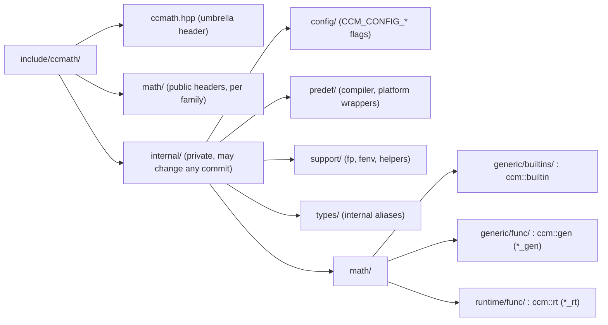
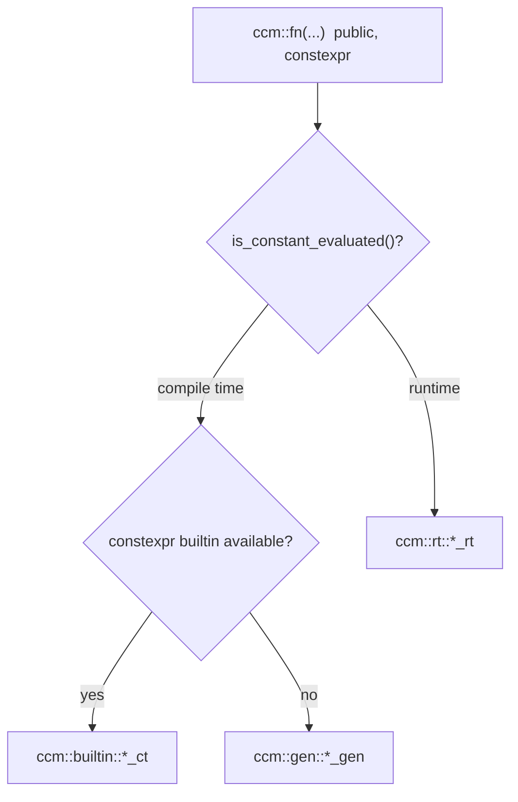

# CCMath conventions

The code-level companion to [CONTRIBUTING.md](CONTRIBUTING.md), which has the tenets,
accuracy policy, and PR workflow. These are the patterns you will see across the
headers, and the ones easy to get wrong.

## Project layout



Public headers live under `math/`, one per function by family. Everything else is
private under `internal/`. Families: `basic`, `compare`, `expo`, `fmanip`, `hyper`,
`misc`, `nearest`, `power`, `special`, `trig`, matching
[cppreference `<cmath>`](https://en.cppreference.com/w/cpp/header/cmath). The key part
is the three-kernel split at the bottom: nearly every function has a `builtin`, a
`gen`, and an `rt` kernel, and which runs depends on where you call it from.

## Dispatch

The public header owns the choice, and you should not add layers between it and the
kernels. Every public `ccm` function is `constexpr` and routes on one question: is
this a constant expression?



At compile time, use the constexpr builtin if one exists (constant evaluation rounds
to nearest, so it is correct), otherwise the generic kernel. At runtime, always `rt`,
since a builtin lowers to libm and we trust it only under `FE_TONEAREST`. That is also
why each non-generic runtime kernel sits in its own `*_rt.hpp` and guards the rounding
mode. `include/ccmath/math/power/pow.hpp` is the shape to copy:

```cpp
template <typename T, std::enable_if_t<std::is_floating_point_v<T>, bool> = true>
constexpr T pow(T base, T exp)
{
    if constexpr (ccm::builtin::has_constexpr_pow<T>)
    {
        if (support::is_constant_evaluated()) { return ccm::builtin::pow_ct(base, exp); }
        return rt::pow_rt(base, exp);
    }
    else
    {
        if (support::is_constant_evaluated()) { return gen::pow_gen(base, exp); }
        return rt::pow_rt(base, exp);
    }
}
```

## Standards conformance

CCMath is a drop-in `<cmath>`: observable behavior matches what the C and C++
standards specify, so swapping `std::` for `ccm::` changes no result. That is why the
edge cases get the same care as ordinary inputs.

The arithmetic overloads apply the [c.math]/3 promotion rule, promoting mixed inputs
to the common floating type and integers to `double`, so `ccm::pow(2, 3.0)` matches
the standard call (`pow.hpp` keeps this in `detail::cmath_pow_result_t`). Special
values follow IEEE 754 and Annex F: NaN propagation, the standard-pinned sign of zero,
and the infinities. Where the standard leaves a result implementation-defined (some
`fmod` NaN cases, the `fpclassify` payload bits), we match the supported compilers
rather than invent one.

Errors follow the C `math_errhandling` model, `errno` plus a floating-point exception
flag, so existing error checks keep working (mechanics under
[Errors and rounding](#errors-and-rounding)). Recent C++ revisions also made `<cmath>`
usable in constant expressions, which is what CCMath already does, so there is no
separate constexpr API.

## Namespaces

The public API is `ccm`, names matching `<cmath>`. The three dispatch layers each get
a namespace, and the rest is internal support.

| Namespace                                                    | Role                                                      | Public |
|--------------------------------------------------------------|-----------------------------------------------------------|--------|
| `ccm`                                                        | public API, names match `<cmath>` (`pow`, `powf`, `powl`) | yes    |
| `ccm::builtin`                                               | compiler-builtin wrappers (`*_ct`)                        | no     |
| `ccm::gen`                                                   | generic kernels (`*_gen`)                                 | no     |
| `ccm::rt`                                                    | runtime kernels (`*_rt`)                                  | no     |
| `ccm::detail`                                                | trait and overload glue local to a public header          | no     |
| `ccm::support` (`::fp`, `::fenv`, `::helpers`), `ccm::types` | internal utilities                                        | no     |

If it is not in `ccm` proper, it is not API and can change in any commit.

## Naming and macros

Names follow `<cmath>` and the surrounding code. Functions are snake_case (`pow`,
`pow_gen`), types PascalCase (`FPBits`, `NormalizedFloat`), and aliases snake_case
with a `_t` suffix (`fp_bits_t`, `half_width_t`). Template parameters are `T` for the
primary type, descriptive PascalCase otherwise (`Integer`, `Real`).

Macros use `CCMATH_` for public, versioning, and compiler config, and `CCM_` for
internal use and the `CCM_CONFIG_*` flags. No other prefixes. Leave a `TODO:` only
when a gap genuinely cannot be closed in the change.

## Support utilities

Check `ccm::support` before hand-rolling anything low-level. `FPBits<T>` (`fp_bits_t`)
takes a float apart into sign, exponent, and mantissa, and builds specials like
`quiet_nan()`, so a raw `bit_cast` is rarely what you want. Use
`ccm::support::is_constant_evaluated()` for the compile-time branch, not the `std::`
one, since C++17 is the floor. Fused multiply-add and the error-free transforms on it
live in `ccm::support::multiply_add`.

## Errors and rounding

CCMath never throws. A domain, pole, or range error sets `errno` and raises the
matching floating-point exception flag through the `ccm::support::fenv` helpers
(`set_errno_if_required`, `raise_except_if_required`), which are config-guarded and
stay quiet during constant evaluation. Report errors that way, not with a C++
exception.

Kernels honor all four IEEE rounding modes at runtime, so read the active mode and
adjust the bit work or the final rounding around it. Never call `fesetround` inside a
kernel, and do not use `#pragma STDC FENV_ACCESS`. The accuracy bar and the
documented-compromise policy are in
[CONTRIBUTING.md](CONTRIBUTING.md#accuracy-and-rounding-goals).

## File conventions

Each header opens with the SPDX license block (Apache-2.0 WITH LLVM-exception) and
`#pragma once`. Project headers come first, as quoted includes from the include
root (`"ccmath/..."`), then standard headers in angle brackets. No `<cmath>`
under `include/`: CCMath is the `<cmath>` here, so use the internal `builtin`, `gen`,
and `rt` kernels.

## C++ usage

C++17 is the minimum, so gate any newer feature on the standard it needs, not on what
a given compiler accepts. Casts are C++-style only (`static_cast`, `reinterpret_cast`,
`const_cast`, `bit_cast`), never the C form. Otherwise it is ordinary modern C++: the
`_v` and `_t` aliases, `enum class`, `using` over `typedef`, and brace initialization.

Two ccmath specifics. `[[nodiscard]]` goes on internal helpers and accessors, not the
public entry points, which mirror the unmarked `<cmath>` signatures. Compiler and
platform checks go through the `internal/predef` wrappers (`has_builtin`,
`has_attribute`, `likely`, `unlikely`, `assume`), not raw `__GNUC__` or `_MSC_VER`.
Everything builds clean under `-Werror` with aggressive warnings.

## Comments

Public entry points get Doxygen: `@brief`, `@param` or `@tparam`, and `@return`.
Implementation comments are for the why, not the what: the constraint, the tradeoff,
the reason a builtin is or is not trusted. `pow.hpp` is a good model.

## Formatting

clang-format is authoritative. Run `lint.sh` or `lint.bat` (which also runs
clang-tidy) before pushing. The settings worth knowing:

| Setting               | Value            |
|-----------------------|------------------|
| Base style            | LLVM             |
| Braces                | Allman           |
| Indent                | tabs, width 4    |
| Column limit          | 160              |
| Namespace indentation | all              |
| Pointer alignment     | middle (`T * x`) |

## Build systems

CMake is the primary build. Meson and Premake are self-contained for consumers and
need no CMake configure first. Library options are declared once in
`cmake/config/BuildManifest.cmake` and flow to the secondary builds from there.
