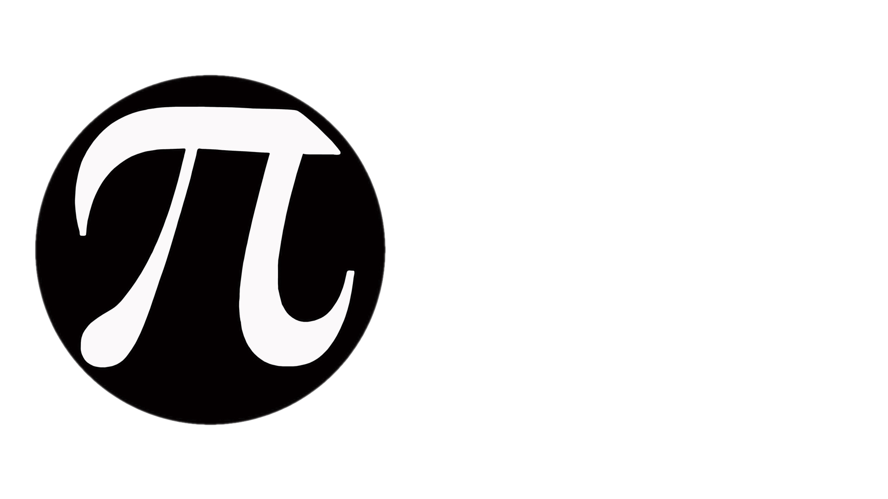

# CCMath - Compile Time \<cmath\> for the Real World

[](https://github.com/Rinzii/ccmath/actions?query=workflow%3Aci-windows)
[](https://github.com/Rinzii/ccmath/actions?query=workflow%3Aci-linux)
[](https://github.com/Rinzii/ccmath/actions?query=workflow%3Aci-macos)
[](https://securityscorecards.dev/viewer/?uri=github.com/Rinzii/ccmath)
[](https://www.bestpractices.dev/projects/9402)
[](
https://opensource.org/licenses/Apache-2.0)
[](https://discord.gg/p3mVxAbdmc)

**CCMath** is a C++17 library that provides a re-implementation of the standard `<cmath>` library with all features made
`constexpr`.
This enables compile-time evaluation of mathematical functions,
improving performance and allows for more efficient code in scenarios where constant expressions are required.

## Features

- **Full constexpr Compatibility**: All functions provided by CCMath are implemented as `constexpr` along with an active
  effort made to ensure all functions work within `static_assert`. The primary goal is to ensure every function can be
  evaluated at compile time.

- **Drop-in Replacement for the Standard Math Library**: CCMath provides a comprehensive set of mathematical functions
  that are 1:1 compatible with the C++ standard library `<cmath>`. The goal of CCMath is to effectively be a drop-in
  replacement for `<cmath>` with little to no discernible difference between the two. This includes trigonometric,
  exponential, logarithmic, and other common mathematical operations. If `<cmath>` has it then it is likely CCMath has
  implemented it.

- **Performance Optimization**: Besides all the functions being able to be evaluated at compile time, CCMath was also
  built with speed in mind. We strive to have speeds nearly as fast as the standard implementation.

- **Optimized Runtime Evaluation**: In all instances where a function cannot be evaluated at compile time, CCMath has
  been optimized to provide the fastest runtime evaluation possible and aims to be as fast as the standard library.

- **Cross-Platform Compatibility**: CCMath is designed to work on all major platforms and compilers. It has been tested
  on Windows, macOS, and Linux with compilers such as GCC, Clang, and MSVC.

- **No External Dependencies**: CCMath has no external dependencies and only requires a modern C++17-compliant compiler.

- **Header-Only Library**: CCMath is a header-only library, making it easy to integrate into your projects.

## Usage

To use CCMath in your projects, include the `<ccmath/ccmath.hpp>` header file and start using the provided functions.
Here's a basic example:

```cpp

#include <ccmath/ccmath.hpp> // Monolithic header file that includes all functions. Similar to including <cmath>
// #include <ccmath/power/sqrt.hpp> // You can also directly include the functions you require without bringing in extra functions!


#include <iostream> // For std::cout

int main() {
    constexpr double x = ccm::sqrt(25.0);  // Compile-time evaluation of square root
    std::cout << "Square root of 25: " << x << std::endl;
    return 0;
}
```

## Adding CCMath to your project

CCMath has a comprehensive cmake setup and can be easily included in your project using fetchcontent like so:

```cmake
cmake_minimum_required(VERSION 3.18)

include(FetchContent)
FetchContent_Declare(
        ccmath
        GIT_REPOSITORY https://github.com/Rinzii/ccmath.git
        GIT_TAG v0.2.0 # Replace with the version you want to use
)
FetchContent_MakeAvailable(ccmath)

target_link_libraries(main PRIVATE ccmath::ccmath)
```

CCMath is also designed with functions being freestanding and header only so you can also just drop the headers directly
into your project!

## Compiler Support

* GCC 11.1+
* Clang 9.0.0+
* AppleClang 14.0.3+ (Lowest tested version)
* MSVC 19.26+
* Intel DPC++ 2022.0.0+
* Nvidia HPC SDK 22.7+ (Lowest tested version)

> [!NOTE]
> Currently working on finding manners to lower these requirements.

## Join Our Discord!

If you have any questions, suggestions, or just want to chat, feel free to join our Discord server!

[](https://discord.gg/p3mVxAbdmc)

## Contributing

CCmath is an open-source project, and it needs your help to go on growing and improving. If you want to get involved and
suggest some additional features, file a bug report or submit a patch, please have a look at
the [contribution guidelines](CONTRIBUTING.md)!

## Implementation Progress (Modules)

| Module                   | % done | In Progress? | Notes? | Planned Completion Version |
|--------------------------|--------|--------------|--------|----------------------------|
| Basic                    | 100    |              |        | v0.1.0 (Released)          |
| Compare                  | 100    |              |        | v0.2.0 (Released)          |
| Exponential              | 57     |              |        | maybe v0.3.0 or v0.4.0     |              
| Float Manipulation       | 25     |              |        |                            |
| Hyperbolic               | 0      |              |        |                            |
| Nearest                  | 33     |              |        |                            |
| Power                    | 5      | ✓            |        | maybe v0.3.0 or v0.4.0     |
| Special Functions        | 0      |              |        |                            |
| Trigonometric            | 0      |              |        |                            |
| Misc Functions           | 30     |              |        |                            |
| Total Library Completion | 37     |              |        |                            |

> Last Updated: Aug 31, 2024

## Implementation Progress (Functions)

| Feature        | % done | TODO                                                                                                        |
|----------------|--------|-------------------------------------------------------------------------------------------------------------|
| abs            | 100    |                                                                                                             |
| fdim           | 100    |                                                                                                             |
| fma            | 100    | Functional. Need to add proper runtime specific speed up.                                                   |
| (f)max         | 100    |                                                                                                             |
| (f)min         | 100    |                                                                                                             |
| remainder      | 100    |                                                                                                             |
| remquo         | 100    |                                                                                                             |
| nan            | 100    | The nan function is still quite brittle, but it has reached a point of functionality.                       |
| fpclassify     | 100    |                                                                                                             |
| isfinite       | 100    |                                                                                                             |
| isgreater      | 100    |                                                                                                             |
| isgreaterequal | 100    |                                                                                                             |
| isinf          | 100    |                                                                                                             |
| isless         | 100    |                                                                                                             |
| islessequal    | 100    |                                                                                                             |
| islessgreater  | 100    |                                                                                                             |
| isnan          | 100    |                                                                                                             |
| isnormal       | 100    |                                                                                                             |
| isunordered    | 100    |                                                                                                             |
| signbit        | 100    | Desire to find a manner of implementing signbit on lower versions of MSVC.                                  |
| exp            | 100    | Needs to be modernized to current CCMath standards                                                          |
| exp2           | 100    | Needs to be modernized to current CCMath standards                                                          |
| expm1          | 0      | Implement function                                                                                          |
| log            | 100    | Needs to be modernized to current CCMath standards                                                          |
| log1p          | 0      | Implement function                                                                                          |
| log2           | 100    | Needs to be modernized to current CCMath standards                                                          |
| log10          | 0      | Implement function                                                                                          |
| copysign       | 100    |                                                                                                             |
| frexp          | 0      | Implement function                                                                                          |
| ilogb          | 0      | Implement function                                                                                          |
| ldexp          | 100    |                                                                                                             |
| logb           | 0      | Implement function                                                                                          |
| modf           | 0      | Implement function                                                                                          |
| nextafter      | 0      | Implement function                                                                                          |
| scalbn         | 100    | Needs to be modernized to current CCMath standards also long double implementation is slow, but functional. |
| acosh          | 0      | Implement function                                                                                          |
| asinh          | 0      | Implement function                                                                                          |
| atanh          | 0      | Implement function                                                                                          |
| cosh           | 0      | Implement function                                                                                          |
| sinh           | 0      | Implement function                                                                                          |
| tanh           | 0      | Implement function                                                                                          |
| ceil           | 0      | Implement function                                                                                          |
| floor          | 100    |                                                                                                             |
| nearbyint      | 0      | Implement function                                                                                          |
| rint           | 0      | Implement function                                                                                          |
| round          | 0      | Implement function                                                                                          |
| trunc          | 100    |                                                                                                             |
| cbrt           | 0      | Implement function                                                                                          |
| hypot          | 0      | Implement function                                                                                          |
| pow            | 30     | Continue implementation process and add documentation and tests                                             |
| sqrt           | 100    |                                                                                                             |
| assoc_laguerre | 0      | Implement function                                                                                          |
| assoc_legendre | 0      | Implement function                                                                                          |
| beta           | 0      | Implement function                                                                                          |
| comp_ellint_1  | 0      | Implement function                                                                                          |
| comp_ellint_2  | 0      | Implement function                                                                                          |
| comp_ellint_3  | 0      | Implement function                                                                                          |
| cyl_bessel_i   | 0      | Implement function                                                                                          |
| cyl_bessel_j   | 0      | Implement function                                                                                          |
| cyl_bessel_k   | 0      | Implement function                                                                                          |
| cyl_neumann    | 0      | Implement function                                                                                          |
| ellint_1       | 0      | Implement function                                                                                          |
| ellint_2       | 0      | Implement function                                                                                          |
| ellint_3       | 0      | Implement function                                                                                          |
| expint         | 0      | Implement function                                                                                          |
| hermite        | 0      | Implement function                                                                                          |
| laguerre       | 0      | Implement function                                                                                          |
| legendre       | 0      | Implement function                                                                                          |
| riemann_zeta   | 0      | Implement function                                                                                          |
| sph_bessel     | 0      | Implement function                                                                                          |
| sph_legendre   | 0      | Implement function                                                                                          |
| sph_neumann    | 0      | Implement function                                                                                          |
| acos           | 0      | Implement function                                                                                          |
| asin           | 0      | Implement function                                                                                          |
| atan           | 0      | Implement function                                                                                          |
| atan2          | 0      | Implement function                                                                                          |
| cos            | 0      | Implement function                                                                                          |
| sin            | 0      | Implement function                                                                                          |
| tan            | 0      | Implement function                                                                                          |
| gamma          | 0      | Implement function                                                                                          |
| lerp           | 90     | Nearly finished, just need to test the function further and validate full compliance.                       |
| lgamma         | 0      | Implement function                                                                                          |

> Last Updated: Aug 31, 2024

## Projects using CCMath!

- [KittyOS](https://github.com/kitty-os/kitty-os/) - KittyOS is meant to be a silly non-unix operating system for cat
  lovers and cats themselves.

_(Are you using CCMath in your project? Let us know!)_

## License

CCMath is distributed under the Apache-2.0 WITH LLVM-exception. See the LICENSE file for more information.

## Special Thanks

Thanks a lot to LLVM, GCC,
and LibM for a lot of insights and inspiration for many different tough issues
encountered throughout the development of CCMath!
