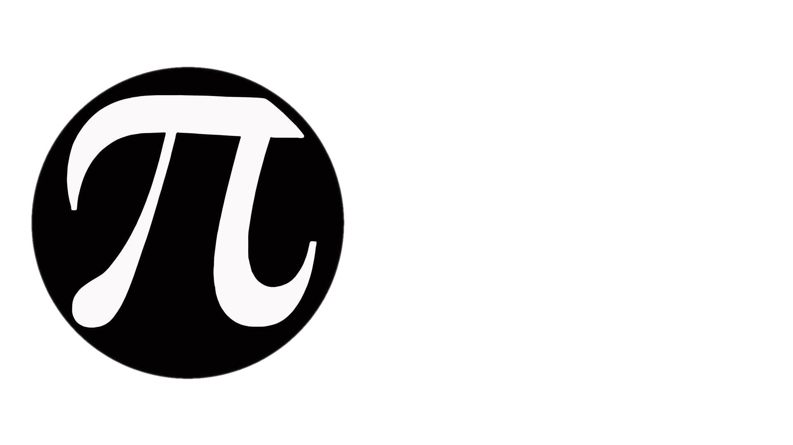

# CCMath asmlab

Local tooling to emit disassembly for registered ccmath functions, score slices
with llvm-mca (and optional uiCA/OSACA), diff against a saved baseline, and run
accuracy gates before a perf patch lands.

## Bootstrap

```bash
bash tools/asmlab/scripts/bootstrap.sh
python3 tools/asmlab/scripts/asmlab.py list
```

## Everyday use

Examples use pow_impl or powf_impl.

```bash
python3 tools/asmlab/scripts/asmlab.py check powf_impl --arch x86-64-v3 --source-map
python3 tools/asmlab/scripts/asmlab.py baseline powf_impl --arch x86-64-v3 --source-map
python3 tools/asmlab/scripts/asmlab.py diff powf_impl --arch x86-64-v3 --source-map
bash tools/asmlab/scripts/bench.sh powf_impl --profile positive_finite_general
python3 tools/asmlab/scripts/asmlab.py gate powf --mode simple
```

`check` runs emit, static scoring, and writes out/asmlab/reports/<fn>.{md,json}.
`verify` is the lighter path check (constexpr + path classify, no full report).

`--source-map` adds line attribution. `--deep-analyze` adds CFG, remarks, spill
counts, and asm pattern tags (slower, needs source map).

## Before merging a perf patch

Confirm the slice is the impl kernel (not libm or a thin jmp), static metrics
move the right way on the arches you ship, the simple gate passes, and the bench
profile you care about is not slower. llvm-mca is a rough model. Disagreement
with hardware or with uiCA is normal.

## Constexpr vs runtime

constexpr_check.py compiles static_assert cases from the registry. Runtime emit
uses harness templates with volatile guards so arguments are not folded away.
A constexpr probe does not describe the runtime slice, and the reverse is true.

registry/functions.json lists harness modes (runtime_no_flatten, runtime_flatten,
constexpr_probe, path_direct). classify.py labels slices such as
ccmath_internal_kernel and external_libm_call. Seeing pow or _pow in the slice
usually means libm, not pow_impl.

## Scenarios and variants

Scenarios fix harness inputs and an intended path label per branch.

```bash
python3 tools/asmlab/scripts/asmlab.py scenario list powf_impl
python3 tools/asmlab/scripts/asmlab.py scenario report powf_impl positive_finite_general \
  --arch x86-64-v3 --source-map
python3 tools/asmlab/scripts/asmlab.py variant init powf_impl --name my_candidate
python3 tools/asmlab/scripts/asmlab.py variant scenario diff powf_impl my_candidate \
  positive_finite_general --arch x86-64-v3 --source-map
python3 tools/asmlab/scripts/asmlab.py variant compare powf_impl --all --arch x86-64-v3
```

Edit candidate code under out/asmlab/variants/ only. If the base file changed
after variant init, refresh or recreate the variant before trusting diffs.

## Bench and gate

Profiles live in registry/benchmark_profiles.json. powf_impl uses the isolated
bench under tools/asmlab/bench/. gate delegates to accuracy_gate.sh and
registry/accuracy_manifest.json.

Rigorous oracle campaigns need CCMATH_RIGOROUS_GATE set to your Docker rigorous
test script. See CONTRIBUTING.md.

## Registry

| Path | Role |
| --- | --- |
| registry/functions.json | Targets, harness modes, constexpr cases |
| registry/path_scenarios.json | Scenario inputs |
| registry/accuracy_manifest.json | Gate coverage |
| registry/benchmark_profiles.json | Bench wiring |
| registry/path_categories.json | Path labels |

## Output layout

Each emit writes region.s, path_analysis.json, and metrics.json under
out/asmlab/<fn>/<arch>-<compiler>-<flags>/. Reports go to out/asmlab/reports/.
Baselines are out/asmlab/baselines/<fn>.json plus optional per-arch snapshot dirs.

## Limits

Static models can disagree with hardware by a wide margin. CFG recovery misses
indirect branches. Register pressure uses heuristics, not true liveness.
On Apple M1 you often get a thin call boundary instead of the full kernel.
Prefer x86-64-v3 for spill and dependency work when the body is not exposed.

---

Part of [CCMath](https://github.com/Rinzii/ccmath). Apache-2.0 WITH LLVM-exception.
See [LICENSE](../../LICENSE).
